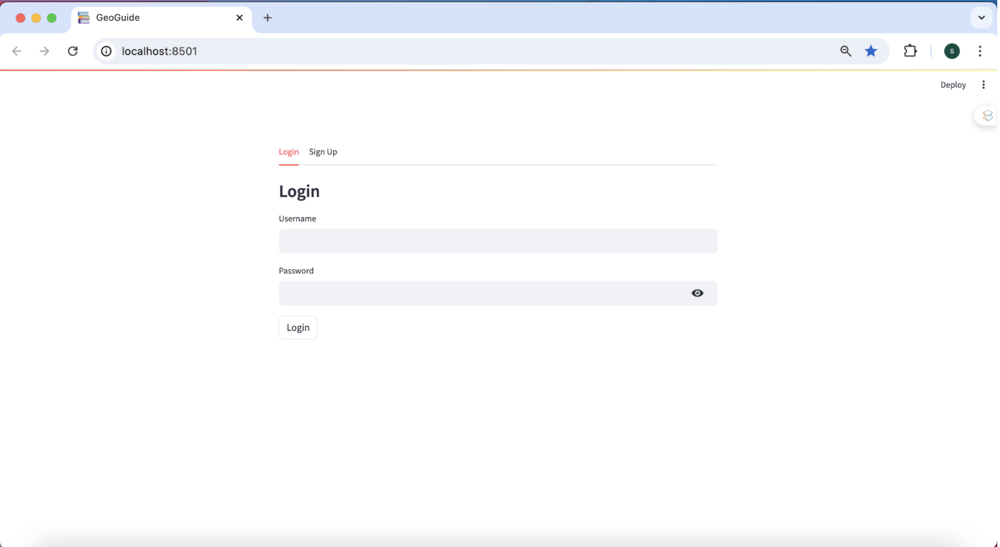

# GeoGuide: AI Chatbot for Indian Mining Regulations

An intelligent chatbot for retrieving information from Indian mining industry acts and regulations using LLMs. Ask questions in natural language and get instant, context-aware answers.

## Screenshots

  

 

 

 

 

## Features

- **AI-Powered Chat** - Natural language queries on mining regulations
- **User Auth** - Secure login/signup with bcrypt
- **Session Persistence** - Automatic chat history
- **Vector Search** - FAISS for semantic search
- **Multi-PDF Support** - Upload regulation documents
- **OpenAI Integration** - GPT-powered responses

## Tech Stack

Streamlit | Python | LangChain | OpenAI API | SQLite | FAISS

## Quick Start

```bash
git clone https://github.com/nabeeeha/GeoGuide.git
cd GeoGuide
python -m venv myenv
source myenv/bin/activate
pip install -r extra/req.txt
```

Create `.env`:
```
OPENAI_API_KEY=your_key
HUGGINGFACEHUB_API_TOKEN=your_token
```

Run:
```bash
streamlit run app.py
```

Upload PDFs to `files/` folder → Click "Start" → Ask questions!

## Architecture

```
GeoGuide/
├── app.py              # Main Streamlit UI
├── auth.py             # User authentication
├── database.py         # SQLite setup
├── chat.py             # Chat sessions
├── process.py          # PDF + embeddings
├── htmlTemplates.py    # UI styling
├── files/              # Upload PDFs here
└── .env               # API keys (not in git)
```

## Security

⚠️ Keep `.env` private (contains API keys)
⚠️ `.gitignore` protects `users.db` and sensitive files

## Contributing

Contributions welcome! Fork → Create PR → Submit
1. Fork the repo
2. Create feature branch
3. Commit changes
4. Push and create PR

## License

MIT License - See LICENSE file

## Support

For issues or questions, create a GitHub issue or contact the maintainer.

